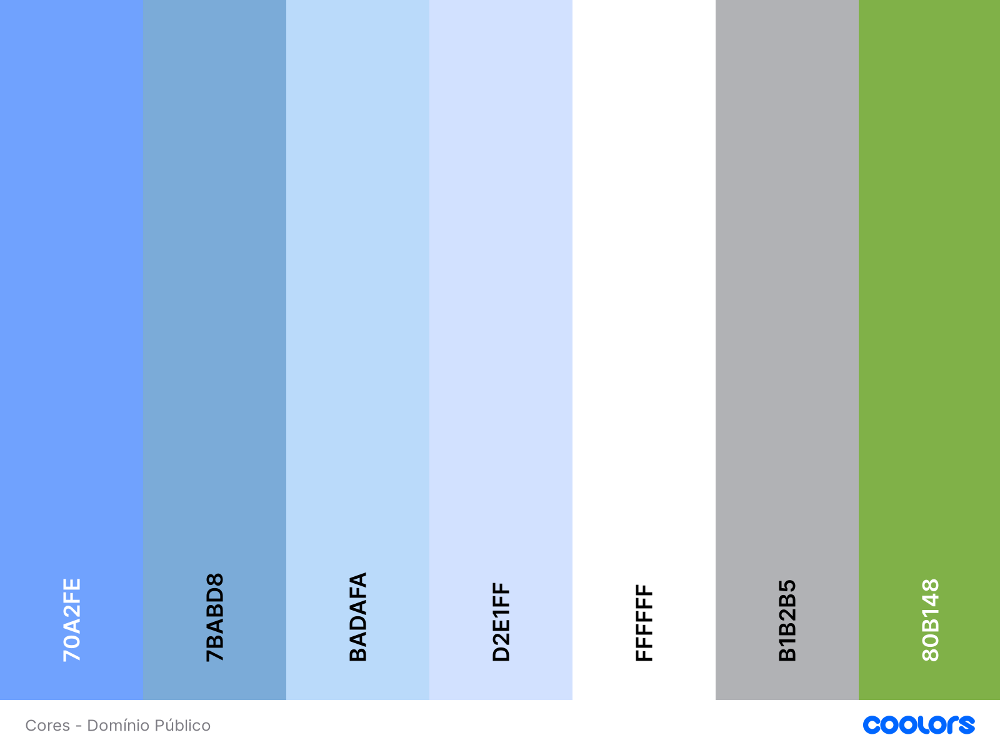
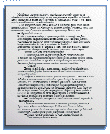
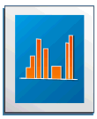
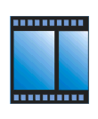
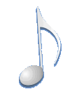
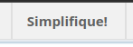
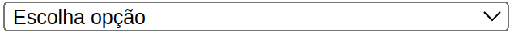
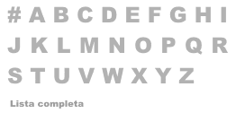
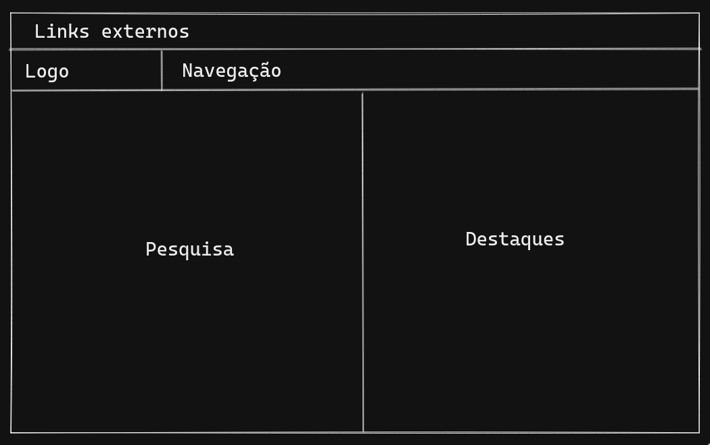

# Guia de Estilo

## Introdução

Utilizado em projetos diversos, o documento do guia de estilo visa reunir e informar, através de documentação, os princípios e diretrizes utilizados na confecção do design do produto. É decidida e registrada pelos desenvolvedores e, em alguns casos, pelos usuários, a identidade visual do projeto, sendo este caso aplicado à biblioteca virtual _Domínio Público_.

## Objetivos

O objetivo principal dessa documento é compreender o design utilizado para o layout da página, os símbolos e outros elementos da página. Após essa compreensão, será criada uma descrição detalhada dos mesmos, que servirá de guia para a criação de protótipos de baixa e alta fidelidade e padronização de futuras implementações no projeto.

## Cores

Para representar as principais cores aderidas ao site, foi utilizada a ferramenta [**Coolors**](https://coolors.co/), que possibilita a criação de uma paleta vertical com cores selecionáveis por código hexadecimal.

A seguir, na imagem 1, segue o resultado da pesquisa pelas cores que foram mais utilizadas, analisando todas as telas do site e anotando as cores mais comuns. É importante citar que algumas outras cores utilizadas no site são produto da junção ou do degradê entre duas das principais.

<figcaption>
<i>Imagem 1: Cores do site Domínio Público</i></figcaption>

## Ícones

Ao buscar pelos ícones que foram utilizados no site, foram encontrados os seguintes itens apresentados na _tabela 1_, em conjunto a uma descrição de onde utilizá-los e um motivo para sua utilização.

<figcaption>
<i>Tabela 1: Ícones do site Domínio Público</i></figcaption>

| Ícone | Descrição |
|----------------------|--------------------------|
| | **Domínio Público:** O ícone do domínio público é utilizado na barra do topo do site, presente em todas as telas. |
| | **Machado:** O ícone Machado é utilizado no menu de destaques, para referenciar um link que levará o usuário ao site de Machado de Assis. |
|| **Música:** O ícone música é utilizado no menu de destaques, para referenciar destaques genéricos com relação a música. |
| | **Filmes:** O ícone de filmes é utilizado no menu de destaques, para referenciar qualquer vídeo que possa estar nele. |
| | **Livros:** O ícone livros é utilizado no menu de destaques, para referenciar obras registradas em livros. |
|  | **Revista:** O ícone da revista é utilizado no menu de destaques, para referenciar o documento do Plano de Desenvolvimento da Educação. |
|  | **Publicação:** O ícone da publicação é utilizado no menu de destaques, para referenciar todas as publicações relacionadas ao Ministério da Educação e derivados. |
| | **Pesquisa por Conteúdo:** O ícone de pesquisa por conteúdo é utilizado na tela principal, referenciando uma rota do site utilizada para filtrar a pesquisa por palavra-chave dentro do conteúdo dos documentos. |
|| **Pesquisa Testes e Dissertações:** O ícone de pesquisa por testes e dissertações é utilizado na tela principal, referenciando uma rota do site utilizada para filtrar a pesquisa por palavra-chave dentro do conteúdo dos documentos de Testes e Dissertações. |
|  | **Pesquisa por Nome do Autor:** O ícone de pesquisa por nome do autor é utilizado na tela principal, referenciando uma rota do site utilizada para filtrar nomes de autores por inicial. |
|  | **Baixar:** O ícone presente no botão em questão é utilizado para representar a ação de baixar um arquivo. Este ícone é presente no site apenas nessa ocasião. |
| | **Texto:** O ícone de texto é utilizado na tela de baixar, representando um exemplo de um documento de texto. Possui uma miniatura que pode ser encontrada acompanhando documentos do tipo 'texto' nas tabelas do site. |
| | **Imagem:** O ícone de imagem é utilizado na tela de baixar, representando um exemplo de imagem. Possui uma miniatura que pode ser encontrada acompanhando documentos do tipo 'imagem' nas tabelas do site. |
|  | **Vídeo:** O ícone de vídeo é utilizado na tela de baixar, representando um exemplo de um arquivo de vídeo. Possui uma miniatura que pode ser encontrada acompanhando documentos do tipo 'vídeo' nas tabelas do site. |
|  | **Som:** O ícone de som é utilizado na tela de baixar, representando um exemplo de um arquivo de áudio. Possui uma miniatura que pode ser encontrada acompanhando documentos do tipo 'som' nas tabelas do site. |
|  | **Lupa:** O ícone da lupa é utilizado em diversos locais do site que representem uma pesquisa. Pode ser encontrado em diversos tamanhos |

## Botões e Entradas

O site apresenta como formas de _input_ (entrada) e botões alguns padrões de estilo. Após analisá-los em seu CSS, foram retiradas as seguintes observações da _tabela 2_:

<figcaption>
<i>Tabela 2: Botões e entradas do site Domínio Público</i></figcaption>

| Ícone | Descrição |
|----------------------|--------------------------|
| | **Botões padrão:** Ao lado pode-se observar o botão padrão do site, utilizado dentro das página.   Esse botão possui uma borda azul clara arredondada, interior de cor branca e tamanho de 68x22 pixels. |
| | **Botões "Ver mais":** Ao lado pode-se observar o botão de "ver mais", com as mesmas cores do botão padrão, porém de tamanho 11x11 e bordas quadradas. |
| | **Botões do menu superior:** Ao lado pode-se observar um exemplo do botão do menu superior, com cores cinzas de fundo, design retangular e tamanhos variáveis dependendo do seu conteúdo, mas sempre mantendo um espaço lateral de 13 pixels à esquerda e 15 à direita, e um espaço de 8 pixels acima e abaixo do texto conteúdo.  |
| | **Caixas de Seleção:** Ao lado pode-se observar uma das entradas do site, a caixa de seleção, que possui um design simples, com fundo branco, texto interno de cor preta, borda de cor preta e tamanho de 15 pixels de altura, com largura variável, porém de máximo 250 pixels. |
| | **Caixas de Texto:** Ao lado pode-se observar uma das entradas do site, a caixa de texto, que possui um design simples, com fundo branco, texto interno de cor preta, borda de cor preta e tamanho de 17 pixels de altura, com largura variável, porém de máximo 277 pixels. |
| | **Botões em letras:** Ao lado podem-se observar os botões de letras, compostos de um fundo branco com o texto cinza. Seu tamanho é de aproximadamente 23x25 para as letras maiúsculas e de 87x14 para o texto inferior, apresentado na imagem. |

## Tipografia

O site utiliza as fontes Verdana e Arial, duas fontes _sans-serif_ (fontes que não tem protuberâncias, ou _serifs_, nas extremidades).
Fontes desse estilo são geralmente usadas para representar simplicidade e minimalismo, e trazem um ar de modernidade para os textos.
Além disso, são frequentemente empregadas em contextos digitais, já que mantém formato uniforme em telas de qualquer resolução.

A fonte Arial foi desenvolvida em 1982 pela empresa [Monotype Typography](https://www.monotype.com/), que se especializa em design de fontes para uso em aparelhos digitais.
Essa fonte está presente na maioria dos computadores modernos, e começou a ser distribuída em sistemas Windows a partir da versão 3.1.
Também é incluída em todas as versões do sistema operacional Mac OS, e é encontrada na maior parte das distribuições Linux.

A Verdana é uma fonte mais recente, sendo desenvolvida em 1996 por Matthew Carter, para ser usada nos sistemas operacionais Windows.
Ainda assim, se tornou uma das fontes _sans-serif_ mais usadas, e pode ser encontrada em 99% de sistemas Windows, 98% de sistemas Mac OS e 67% de sistemas Linux.

Como essas fontes são amplamente usadas, elas são uma boa escolha para interfaces gráficas que desejam ser familiares para diversos públicos alvo, como é o caso do Domínio Público.

No design atual, não existe uma padronização do tamanho da tipografia.
Grande parte da interface do site é composta por imagens, e isso dificulta na implementação de padrões visuais.
Usar imagens ao invés de textos também afeta a acessibilidade, já que leitores de tela não conseguem interpretar com facilidade o que está sendo descrito na interface.

Assim, é importante que trabalhos de design levem em consideração essas dificuldades, e minimizem o uso de imagens para representar elementos que poderiam ser descritos como texto.
Também é necessário esforço para padronizar os tamanhos utilizados, visando trazer consistência visual para a interface.

## Layout

O layout de uma aplicação é a maneira de organização dos elementos gráficos da interface.
Deve existir uma preocupação com a ordenação e disposição das informações, para que não haja dificuldade na hora de interagir com o sistema.

Com o intuito de facilitar a visualização, o layout do site é mostrado na imagem abaixo.

<figcaption>
Imagem 2 - Imagem do layout - Elaboração Própria
</figcaption>

 
## Referência bibliográfica

> Barbosa, S. D. J.; Silva, B. S. da; Silveira, M. S.; Gasparini, I.; Darin, T.; Barbosa, G. D. J. (2021) Interação Humano-Computador e Experiência do usuário. Autopublicação.

## Histórico de Versão

| Versão | Data | Descrição | Autor | Revisor |
|--------|------|-----------|-------|---------| 
| 0.1 | 30/07/2022 | Documento Inicial | Gabriel Moretti | Adne Moretti
| 0.2 | 30/07/2022 | Adição de cores e ícones | Gabriel Moretti | Adne Moretti
| 0.3 | 30/07/2022 | Adição tipografia | Guilherme Puida | Adne Moretti
| 0.4 | 01/08/2022 | Adição Layout | Guilherme Puida | Adne Moretti
| 0.5 | 01/08/2022 | Adição Botões e entradas | Gabriel Moretti | Adne Moretti
