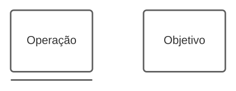
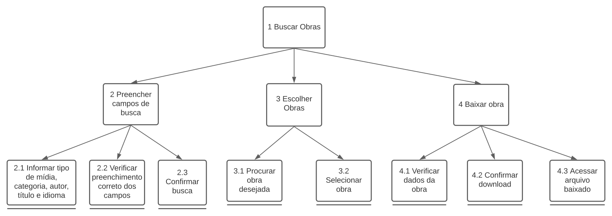
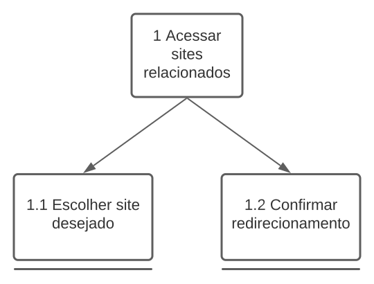

# Análise de tarefas

## Introdução

A análise de tarefas tem por objetivo, compreender sobre o trabalho dos usuários, como realizam esse trabalho e por quê realizam. Ela pode ser utilizada em diferentes momentos no desenvolvimento de um software: para a análise da situação atual (apoiada ou não por um sistema computacional), para o (re)design de um sistema computacional ou para a avaliação do resultado de uma intervenção que inclua a introdução de um (novo) sistema computacional [1].

As análises de tarefas devem envolver um processo de coleta de dados responsáveis por definir objetivos dos usuários dentro da plataforma. No livro Interação Humano-Computador de Simone Diniz e Bruno Siqueira, é apresentado três dos métodos mais comuns de análise de tarefas: O Análise Hierárquica de Tarefas (HTA), GOMS e o ConcurTaskTrees.

No presente projeto, utilizaremos o HTA e o ConcurTaskTrees.

## Análise Hierárquica de Tarefas (HTA)

Ajuda a relacionar o que as pessoas fazem (ou se recomenda que façam), por que o fazem, e quais as consequências caso não o façam corretamente. Ela se baseia em psicologia funcional, e não comportamental, como eram as abordagens da época em que foi criada.

Segue, na _figura 1_ e nos dois próximos pontos, uma legenda para os elementos que foram utilizados nas HTA criadas neste método.

    
<i>Figura 1 - Legenda para as HTAs</i>

- **Objetivo:** Um objetivo é um estado específico de coisas, um estado final.Podendo ser definido por um ou mais eventos ou por valores fisicamente observáveis de uma ou mais variáveis, que atuam como critério de alcance do objetivo , em última instância, do desempenho do sistema.
- **Operação:** Uma operação é especificada pelas circunstâncias nas quais o objetivo é ativado (input ou entrada), pelas atividades ou ações (actions) que contribuem para atingí-lo e pelas condições que indicam o seu atingimento (feedback).

Seguindo o método em questão, foram confeccionados diagramas para as principais tarefas encontradas, sendo elas separadas nos itens **HTA01** (_figura 2_) e **HTA02** (_figura 3_).

### HTA01 - Buscar Obras

    
<i>Figura 2 - HTA para busca de obras</i>

### HTA02 - Acessar sites relacionados

 
<i>Figura 3 - HTA para sites relacionados</i>

## Histórico de versão

| Versão | Data       | Descrição                                 | Autor        | Revisor   |
| ------ | ---------- | ----------------------------------------- | ------------ | --------- |
| 0.1    | 17/07/2022 | Documento inicial                         | Gabriel Moretti    |
